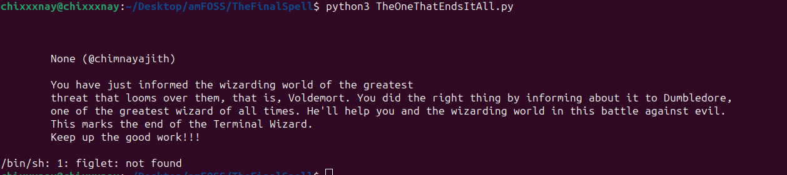

## Step-by-Step Explanation on completing Terminal Wizard

### 1. Enter the maze
- Cloned the github repo using `git clone https://github.com/KshitijThareja/TerminalWizard.git`
- Created a folder named codes in ./task-01 with the command mkdir codes

### 2. First challenge
- The first perfect number is 6 and the solution to the math problem is 5. (y = 2x-7 where x is 6). The first spell is in 06/Spell_05.txt
- cd'd into the spellbook folder and run the Impedimenta.py file to get the first code.

### 3. Second Challenge
- The earliest used element in semiconductors is Germanium with atomic number 32. And with that the second spell is in 02/Spell_02.txt according to the given instructions.
- In the /spellbook folder to run the Stupefy.txt file to get the next code.

### 4. Third Challenge
- Prof. Lupin teaches Defense Against Dark Arts.
- The solution to the riddle is "Boggart" which is a creature that takes the form of the whatever most frightens the person who encounters it. On searching the web, the spell "Riddikulus" will change it to whatever the person casting the spell thinks!
- But the particular Riddikulus.py is not present in the main branch. Using the `git checkout defenceAgainstTheDarkArts -- riddikulus.py` from the /spellbook directory copies the file to the main branch. On running the file, I got the third part of the code.

### 5. Fourth challenge 
- The next code is hidden in the commit logs. On running `git log` in the main branch will reveal the next part of the code.
- The first part of the clue makes no sense to me though :) Anyways, With this all 4 parts of the code have been revealed.

### 6. The End
- The concatinated code as per instructed is in the finalcode.txt file. 
- On decoding the string using `echo "<finalCode> | base64 --decode"` gives a link to yet another github repo : "The Final Spell"

### The Final Spell
- On cloning into the repo and running the TheOneThatEndsItAll.py shows a message congratulating the user.

### Commit and push to my amfoss-tasks repo
There are three commands that I used
- git add [folder name] : I used `git add task-01`
- `git commit` : and then provide the commit message
- `git push` : this will push the committed changes to the repo
